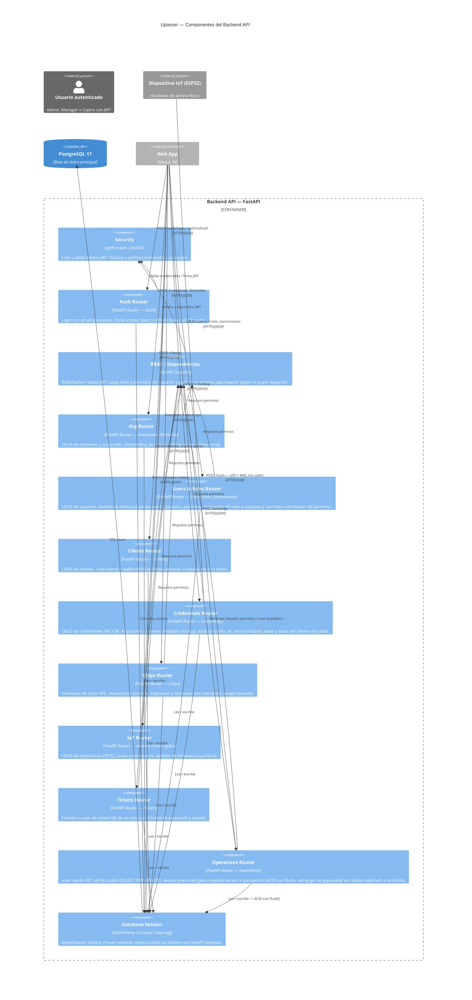

# C4 — Level 3: Components (Backend API)

```mermaid
C4Component
  title Upasser — Componentes del Backend API

  Person_Ext(user, "Usuario autenticado", "Admin, Manager o Cajero con JWT")
  System_Ext(esp32, "Dispositivo IoT (ESP32)", "Hardware de acceso físico")
  ContainerDb(db, "PostgreSQL 17", "Base de datos principal")
  Container_Ext(webapp, "Web App", "Next.js 16")

  Container_Boundary(api, "Backend API — FastAPI") {

    Component(security, "Security", "python-jose / passlib", "Crea y valida tokens JWT. Hashea y verifica contraseñas con bcrypt.")

    Component(auth_router, "Auth Router", "FastAPI Router — /auth", "Login con email+password. Emite access token y refresh token. Usa Security.")

    Component(rbac, "RBAC / Dependencies", "FastAPI Depends", "RoleChecker: valida JWT, carga roles y permisos del usuario, y autoriza o rechaza cada request según el scope requerido.")

    Component(org_router, "Org Router", "FastAPI Router — /companies /branches", "CRUD de empresas y sucursales. Onboarding de nuevas empresas con admin inicial.")

    Component(users_router, "Users & Roles Router", "FastAPI Router — /users /roles /permissions", "CRUD de usuarios. Gestión de roles (con protección is_system) y permisos. Asignación de roles a usuarios y overrides individuales de permisos.")

    Component(clients_router, "Clients Router", "FastAPI Router — /clients", "CRUD de clientes. Crea cliente + wallet MAIN de forma atómica. Consulta por CI o email.")

    Component(credentials_router, "Credentials Router", "FastAPI Router — /credentials", "CRUD de credenciales NFC/QR. Asignación a clientes. Endpoint /lookup: dado un public_id, retorna estado, saldo y datos del cliente vinculado.")

    Component(chips_router, "Chips Router", "FastAPI Router — /chips", "Inventario de chips NFC. Importación por lote. Asignación y activación por lote (batch assign/activate).")

    Component(iot_router, "IoT Router", "FastAPI Router — /devices /zones /gates", "CRUD de dispositivos ESP32, zonas y torniquetes. Gestión de infraestructura física.")

    Component(tickets_router, "Tickets Router", "FastAPI Router — /tickets", "Emisión y canje de tickets QR de un solo uso. Control de expiración y estado.")

    Component(operations_router, "Operations Router", "FastAPI Router — /operations", "scan: valida UID, verifica saldo (SELECT FOR UPDATE), deduce precio del gate y registra acceso + transacción (ACID con flush). recharge: recarga wallet de cliente registrado o anónimo.")

    Component(db_session, "Database Session", "SQLAlchemy 2.0 async / asyncpg", "AsyncSession factory. Provee sesiones async a todos los routers vía FastAPI Depends.")
  }

  %% Entradas externas
  Rel(webapp, auth_router, "POST /auth/login, /auth/refresh", "HTTPS/JSON")
  Rel(webapp, org_router, "CRUD /companies, /branches", "HTTPS/JSON")
  Rel(webapp, users_router, "CRUD /users, /roles, /permissions", "HTTPS/JSON")
  Rel(webapp, clients_router, "CRUD /clients", "HTTPS/JSON")
  Rel(webapp, credentials_router, "CRUD + /lookup", "HTTPS/JSON")
  Rel(webapp, chips_router, "Inventario + batch ops", "HTTPS/JSON")
  Rel(webapp, iot_router, "CRUD /devices, /zones, /gates", "HTTPS/JSON")
  Rel(webapp, tickets_router, "Emitir y canjear tickets", "HTTPS/JSON")
  Rel(webapp, operations_router, "POST /recharge", "HTTPS/JSON")
  Rel(esp32, operations_router, "POST /scan — UID + MAC (sin auth)", "HTTP/JSON")

  %% Auth y RBAC
  Rel(auth_router, security, "Valida credenciales / firma JWT")
  Rel(rbac, security, "Verifica y decodifica JWT")
  Rel(org_router, rbac, "Requiere permisos")
  Rel(users_router, rbac, "Requiere permisos")
  Rel(clients_router, rbac, "Requiere permisos")
  Rel(credentials_router, rbac, "Requiere permisos")
  Rel(chips_router, rbac, "Requiere permisos")
  Rel(iot_router, rbac, "Requiere permisos")
  Rel(tickets_router, rbac, "Requiere permisos")
  Rel(operations_router, rbac, "Recharge requiere permisos / scan es público")

  %% Acceso a BD
  Rel(auth_router, db_session, "Consulta usuario")
  Rel(org_router, db_session, "Lee / escribe")
  Rel(users_router, db_session, "Lee / escribe")
  Rel(clients_router, db_session, "Lee / escribe")
  Rel(credentials_router, db_session, "Lee / escribe")
  Rel(chips_router, db_session, "Lee / escribe")
  Rel(iot_router, db_session, "Lee / escribe")
  Rel(tickets_router, db_session, "Lee / escribe")
  Rel(operations_router, db_session, "Lee / escribe — ACID con flush()")
  Rel(db_session, db, "SQL async")

  UpdateLayoutConfig($c4ShapeInRow="4", $c4BoundaryInRow="1")
```
