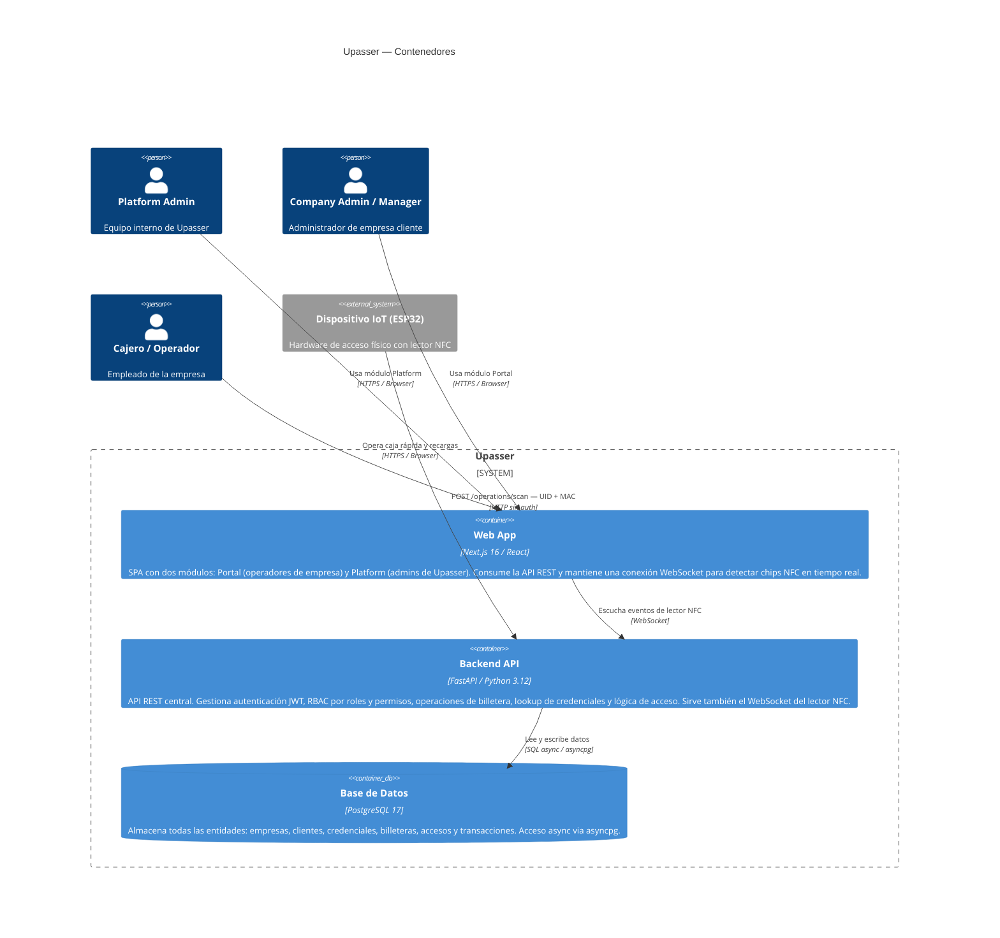

# C4 — Level 2: Containers

```mermaid
C4Container
  title Upasser — Contenedores

  Person(platform_admin, "Platform Admin", "Equipo interno de Upasser")
  Person(company_admin, "Company Admin / Manager", "Administrador de empresa cliente")
  Person(cajero, "Cajero / Operador", "Empleado de la empresa")
  System_Ext(esp32, "Dispositivo IoT (ESP32)", "Hardware de acceso físico con lector NFC")

  System_Boundary(upasser, "Upasser") {

    Container(webapp, "Web App", "Next.js 16 / React", "SPA con dos módulos: Portal (operadores de empresa) y Platform (admins de Upasser). Consume la API REST y mantiene una conexión WebSocket para detectar chips NFC en tiempo real.")

    Container(api, "Backend API", "FastAPI / Python 3.12", "API REST central. Gestiona autenticación JWT, RBAC por roles y permisos, operaciones de billetera, lookup de credenciales y lógica de acceso. Sirve también el WebSocket del lector NFC.")

    ContainerDb(db, "Base de Datos", "PostgreSQL 17", "Almacena todas las entidades: empresas, clientes, credenciales, billeteras, accesos y transacciones. Acceso async via asyncpg.")
  }

  Rel(platform_admin, webapp, "Usa módulo Platform", "HTTPS / Browser")
  Rel(company_admin, webapp, "Usa módulo Portal", "HTTPS / Browser")
  Rel(cajero, webapp, "Opera caja rápida y recargas", "HTTPS / Browser")

  Rel(webapp, api, "Llama endpoints REST", "JSON / HTTPS")
  Rel(webapp, api, "Escucha eventos de lector NFC", "WebSocket")

  Rel(api, db, "Lee y escribe datos", "SQL async / asyncpg")

  Rel(esp32, api, "POST /operations/scan — UID + MAC", "HTTP sin auth")

  UpdateLayoutConfig($c4ShapeInRow="3", $c4BoundaryInRow="1")
```
