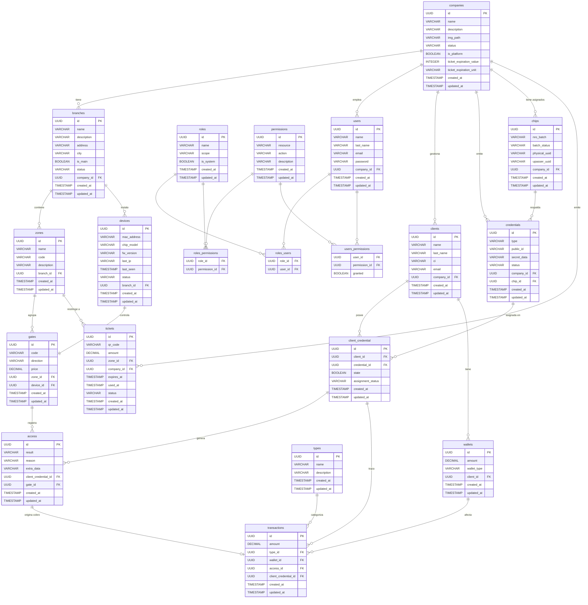

# ERD — Upasser

```mermaid
erDiagram

  companies {
    UUID id PK
    VARCHAR name
    VARCHAR description
    VARCHAR img_path
    VARCHAR status
    BOOLEAN is_platform
    INTEGER ticket_expiration_value
    VARCHAR ticket_expiration_unit
    TIMESTAMP created_at
    TIMESTAMP updated_at
  }

  branches {
    UUID id PK
    VARCHAR name
    VARCHAR description
    VARCHAR address
    VARCHAR city
    BOOLEAN is_main
    VARCHAR status
    UUID company_id FK
    TIMESTAMP created_at
    TIMESTAMP updated_at
  }

  roles {
    UUID id PK
    VARCHAR name
    VARCHAR scope
    BOOLEAN is_system
    TIMESTAMP created_at
    TIMESTAMP updated_at
  }

  permissions {
    UUID id PK
    VARCHAR resource
    VARCHAR action
    VARCHAR description
    TIMESTAMP created_at
    TIMESTAMP updated_at
  }

  roles_permissions {
    UUID role_id FK
    UUID permission_id FK
  }

  users {
    UUID id PK
    VARCHAR name
    VARCHAR last_name
    VARCHAR email
    VARCHAR password
    UUID company_id FK
    TIMESTAMP created_at
    TIMESTAMP updated_at
  }

  roles_users {
    UUID role_id FK
    UUID user_id FK
  }

  users_permissions {
    UUID user_id FK
    UUID permission_id FK
    BOOLEAN granted
  }

  zones {
    UUID id PK
    VARCHAR name
    VARCHAR code
    VARCHAR description
    UUID branch_id FK
    TIMESTAMP created_at
    TIMESTAMP updated_at
  }

  devices {
    UUID id PK
    VARCHAR mac_address
    VARCHAR chip_model
    VARCHAR fw_version
    VARCHAR last_ip
    TIMESTAMP last_seen
    VARCHAR status
    UUID branch_id FK
    TIMESTAMP created_at
    TIMESTAMP updated_at
  }

  gates {
    UUID id PK
    VARCHAR code
    VARCHAR direction
    DECIMAL price
    UUID zone_id FK
    UUID device_id FK
    TIMESTAMP created_at
    TIMESTAMP updated_at
  }

  clients {
    UUID id PK
    VARCHAR name
    VARCHAR last_name
    VARCHAR ci
    VARCHAR email
    UUID company_id FK
    TIMESTAMP created_at
    TIMESTAMP updated_at
  }

  chips {
    UUID id PK
    VARCHAR nro_batch
    VARCHAR batch_status
    VARCHAR physical_uuid
    VARCHAR upasser_uuid
    UUID company_id FK
    TIMESTAMP created_at
    TIMESTAMP updated_at
  }

  credentials {
    UUID id PK
    VARCHAR type
    VARCHAR public_id
    VARCHAR secret_data
    VARCHAR status
    UUID company_id FK
    UUID chip_id FK
    TIMESTAMP created_at
    TIMESTAMP updated_at
  }

  client_credential {
    UUID id PK
    UUID client_id FK
    UUID credential_id FK
    BOOLEAN state
    VARCHAR assignment_status
    TIMESTAMP created_at
    TIMESTAMP updated_at
  }

  tickets {
    UUID id PK
    VARCHAR qr_code
    DECIMAL amount
    UUID zone_id FK
    UUID company_id FK
    TIMESTAMP expires_at
    TIMESTAMP used_at
    VARCHAR status
    TIMESTAMP created_at
    TIMESTAMP updated_at
  }

  wallets {
    UUID id PK
    DECIMAL amount
    VARCHAR wallet_type
    UUID client_id FK
    TIMESTAMP created_at
    TIMESTAMP updated_at
  }

  types {
    UUID id PK
    VARCHAR name
    VARCHAR description
    TIMESTAMP created_at
    TIMESTAMP updated_at
  }

  access {
    UUID id PK
    VARCHAR result
    VARCHAR reason
    VARCHAR extra_data
    UUID client_credential_id FK
    UUID gate_id FK
    TIMESTAMP created_at
    TIMESTAMP updated_at
  }

  transactions {
    UUID id PK
    DECIMAL amount
    UUID type_id FK
    UUID wallet_id FK
    UUID access_id FK
    UUID client_credential_id FK
    TIMESTAMP created_at
    TIMESTAMP updated_at
  }

  %% ── Organización ──────────────────────────────────────────
  companies ||--o{ branches          : "tiene"
  companies ||--o{ users             : "emplea"
  companies ||--o{ clients           : "gestiona"
  companies ||--o{ credentials       : "emite"
  companies ||--o{ chips             : "tiene asignados"
  companies ||--o{ tickets           : "emite"

  branches  ||--o{ zones             : "contiene"
  branches  ||--o{ devices           : "instala"

  roles     ||--o{ roles_users       : ""
  users     ||--o{ roles_users       : ""

  roles     ||--o{ roles_permissions : ""
  permissions ||--o{ roles_permissions : ""

  users     ||--o{ users_permissions : ""
  permissions ||--o{ users_permissions : ""

  %% ── IoT ───────────────────────────────────────────────────
  zones     ||--o{ gates             : "agrupa"
  devices   ||--|| gates             : "controla"

  %% ── Clientes ──────────────────────────────────────────────
  chips     ||--o{ credentials       : "respalda"
  clients   ||--o{ client_credential : "posee"
  credentials ||--o{ client_credential : "asignada en"
  clients   ||--o{ wallets           : "tiene"

  zones     ||--o{ tickets           : "restringe a"

  %% ── Operaciones ───────────────────────────────────────────
  client_credential ||--o{ access        : "genera"
  gates             ||--o{ access        : "registra"
  access            ||--o| transactions  : "origina cobro"
  wallets           ||--o{ transactions  : "afecta"
  types             ||--o{ transactions  : "categoriza"
  client_credential ||--o{ transactions  : "traza"
```
